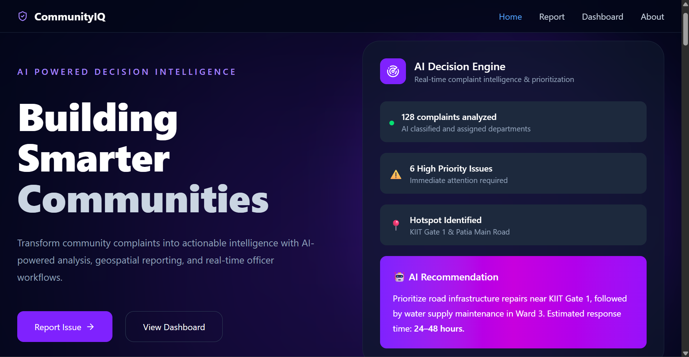
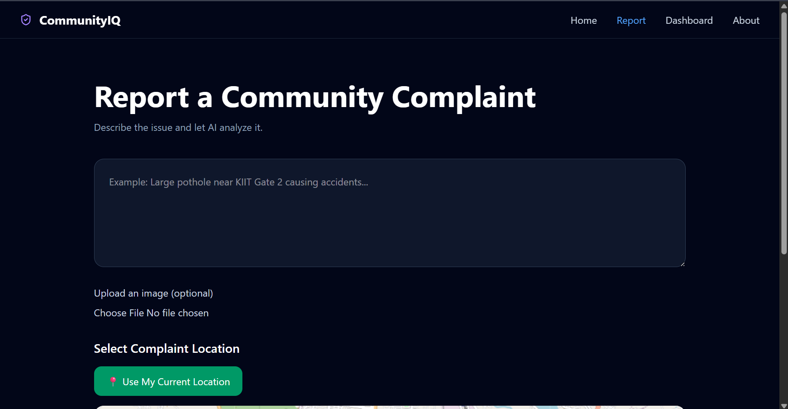
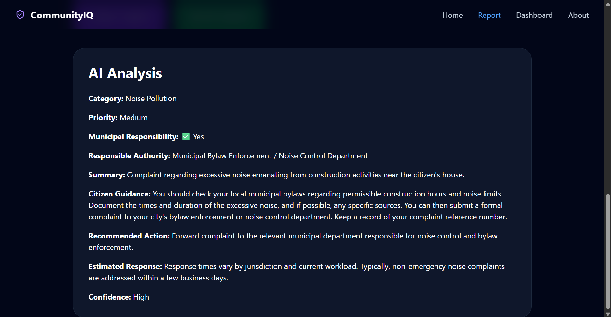
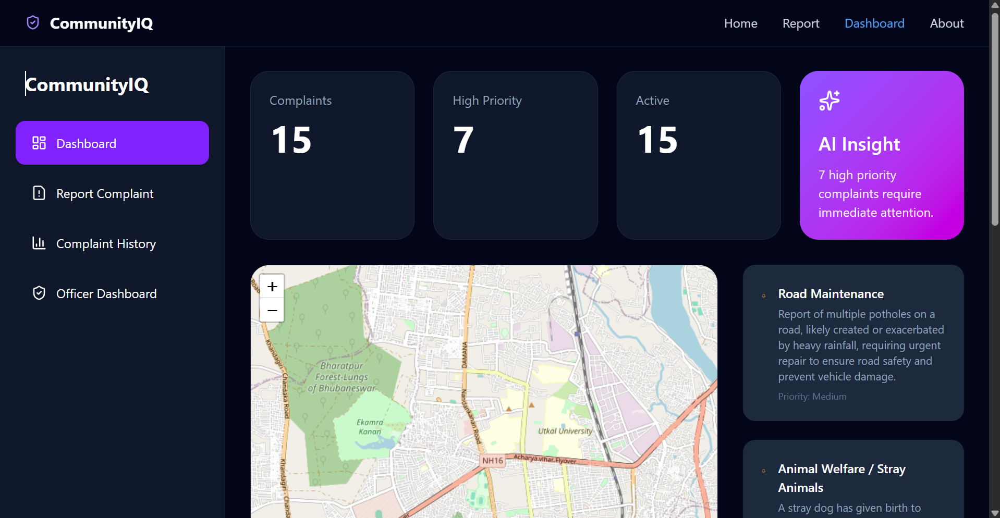
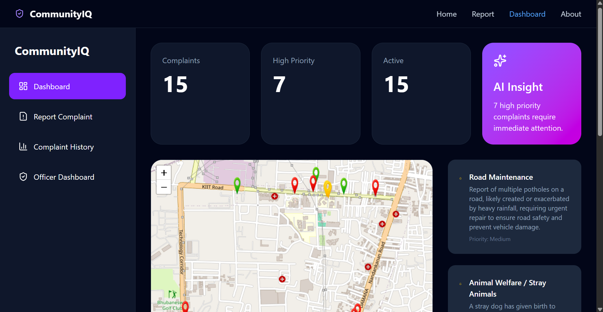
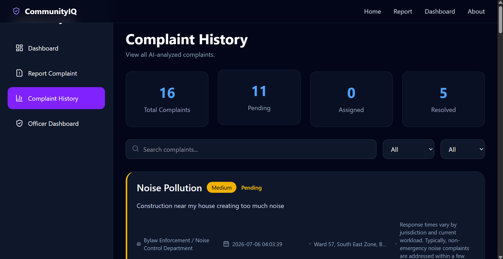

# CommunityIQ 

An AI-powered Smart Community Complaint Management Platform that helps citizens report civic issues using text, images, and GPS locations while intelligently routing complaints to the appropriate authorities through multimodal AI.

---

## 📖 Overview

CommunityIQ modernizes the traditional complaint reporting process by combining Artificial Intelligence, geospatial mapping, and officer workflows into a single platform.

Citizens can submit complaints using text, images, and location data. The AI analyzes the complaint, determines its category, urgency, responsible authority, and provides practical guidance for the citizen. Officers can then review, manage, and update complaint statuses through a dedicated dashboard.

Rather than simply classifying complaints, the platform intelligently determines whether an issue falls under municipal responsibility or should instead be directed to another authority such as the police, emergency services, or utility providers.

---

## ✨ Features

### 👥 Citizen Portal

- Submit complaints using text
- Upload complaint images
- Select complaint location on an interactive map
- Use current GPS location automatically
- AI-powered complaint analysis
- View community dashboard
- Complaint analytics
- Interactive complaint map

---

### 👮 Officer Portal

- Dedicated officer dashboard
- Complaint management interface
- Search complaints
- Filter complaints
- Update complaint status
- View complaint locations
- Community-wide analytics

---

### 🤖 AI Features

- Multimodal AI (Text + Image)
- Automatic complaint categorization
- Priority detection
- Responsible authority recommendation
- Municipal scope detection
- Citizen guidance generation
- Emergency detection
- AI-generated recommended actions
- Estimated response time prediction

---

## 🧠 AI Workflow

Citizen Complaint

↓

Text + Image + GPS Location

↓

Gemini AI Analysis

↓

Complaint Validation

↓

Category Detection

↓

Priority Detection

↓

Responsible Authority Identification

↓

Municipal Scope Analysis

↓

Citizen Guidance Generation

↓

Complaint Stored in Database

↓

Officer Dashboard

---

## 🗺️ Mapping Features

- Interactive Leaflet Maps
- Manual location selection
- Current GPS location
- Complaint visualization
- Officer complaint map

---

## 🛠️ Tech Stack

### Frontend

- React
- Vite
- Tailwind CSS
- React Router
- React Leaflet
- Lucide React

### Backend

- Flask
- SQLite
- Flask-CORS

### AI

- Google Gemini API
- Multimodal Image + Text Analysis

### Maps

- Leaflet
- OpenStreetMap
- Browser Geolocation API

---

## 📂 Project Structure

```
communityiq/

├── frontend/
│   ├── components/
│   ├── pages/
│   ├── services/
│   └── assets/
│
├── backend/
│   ├── database/
│   ├── services/
│   ├── uploads/
│   └── app.py
│
└── README.md
```

---

## 🚀 Getting Started

### Clone the repository

```bash
git clone https://github.com/yourusername/communityiq.git
```

### Backend

```bash
cd backend

pip install -r requirements.txt

python app.py
```

### Frontend

```bash
cd frontend

npm install

npm run dev
```

---

# 📸 Screenshots

## Landing Page



---

## Report Complaint



---

## AI Analysis



---

## Citizen Dashboard



---

## Officer Dashboard



---

## Complaint History



---

## 🔮 Future Scope

- Officer Authentication
- Reverse Geocoding
- Complaint History
- Complaint Withdrawal
- Enhanced Analytics Dashboard
- Citizen Complaint Tracking
- Better Map Markers
- Notification System
- Admin Dashboard
- Role-Based Access Control

---

## 🎯 Motivation

Most civic complaint systems only allow users to submit issues manually, often leaving them uncertain about whether their complaint is valid or which department is responsible.

CommunityIQ uses AI to bridge this gap by intelligently analyzing complaints, recommending the correct authority, identifying emergencies, and providing actionable guidance to citizens before their complaint enters the workflow.

---

## 👨‍💻 Developed By

**Sushree Subhangini Mohanty**

B.Tech Computer Science & Engineering

KIIT University

---

## 📄 License

This project is developed for educational and hackathon purposes.
